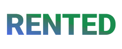

# Rented: Your Sustainable Item Rental Platform

To run the platfrom you should install requirements.txt and run the server.  
`pip install -r requirements.txt`  
`./manage.py runserver`

## Overview

Welcome to Rented, your premier platform for item rental. Our mission is to simplify your life by offering a convenient space where users can easily rent the items they need for a short period. We believe in the power of sharing resources to save both money and the environment.

## Platform Features

### 1. User and admin accounts

Rented provides a structure for platfrom to manage on different levels.

### 2. User-Friendly Experience

Our platform is designed to be user-friendly, making it easy for users to browse, select, and rent items hassle-free.

### 3. Sustainability

We are committed to promoting a sustainable lifestyle by encouraging the sharing of resources. Renting items reduces waste and contributes to a more eco-friendly way of living.

## How It Works

1. **Browse Items:** Explore our catalog of items available for rent.

2. **Select & Rent:** Choose the items you need and proceed with the offer process.

3. **Community Sharing:** Join a community of like-minded individuals who believe in the power of sharing resources.

## Why Rented?

- **Cost-Effective:** Save money by renting items instead of purchasing them for short-term use.

- **Environmental Impact:** Contribute to a greener planet by participating in a sharing economy.

- **Community Building:** Connect with others who share a similar mindset about sustainability and responsible consumption.

## Future Enhancements

We are continuously working to enhance the Rented experience. Future updates may include:

- **Expanded Catalog:** Regularly update our catalog with a wider range of items to meet diverse needs.

## Join Rented Today!

Embrace a more sustainable and cost-effective lifestyle by joining Rented. Browse our catalog, rent items, and be part of a community that values sharing and environmental responsibility.

Happy renting!
